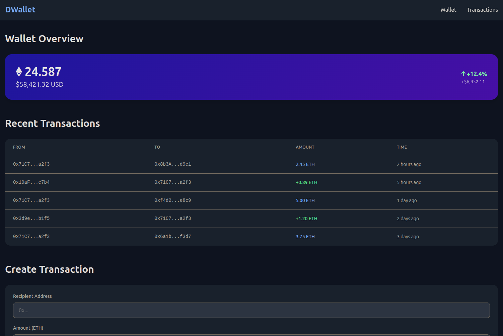
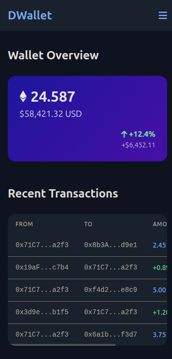
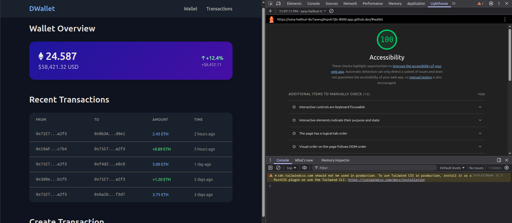

# GMWallet

In school, I built this dashboard for a mock DeFi project. The goal was to build a professional and user-friendly interface for Web3 systems with HTML and CSS (incl. Tailwind in my case). We had to prioritize good UI/UX. 

## Screenshots

### Desktop
 

### Mobile

## Accessibility

